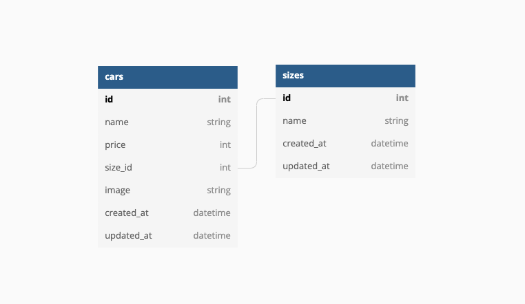

# Car Management Dashboard

## How to run
Berikut cara menjalankan project ini

1. Clone project ini.
2. Pastikan folder project sudah aktif pada terminal atau command line.
3. Duplicate file .env.example dengan nama .env dengan menjalankan perintah `cp .env.example .env`.
4. Pastikan sequelize cli sudah terinstall. Untuk instalasi sequelize, jalankan perintah `npm install -g sequelize-cli` pada terminal atau command line.
5. Jalankan `npm install`  untuk menginstall package project ini pada terminal atau command line.

## ERD

